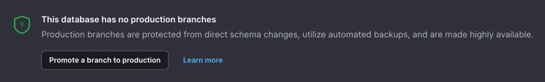

## Next.js starter

This is a [Next.js](https://nextjs.org/) project that uses [Prisma](https://www.prisma.io/) to connect to a [PlanetScale](https://planetscale.com/) database and [Tailwind CSS](https://tailwindcss.com/) for styling.

## Getting Started

Clone the repository.

```bash
git clone https://github.com/planetscale/nextjs-starter
```

Install dependencies.

```bash
npm install
```

## Set up the database

Create a PlanetScale database in the [dashboard](https://app.planetscale.com/) or by using the [CLI](https://planetscale.com/cli). Then, create a Connection string for your database by following the [documentation](https://docs.planetscale.com/concepts/connection-strings).

Copy the `.env.example` file as `.env` and update the `DATABASE_URL` property with the following format.

```text
mysql://<USERNAME>:<PLAIN_TEXT_PASSWORD>@<ACCESS_HOST_URL>/<DATABASE_NAME>?sslaccept=strict
```

Push the database schema to your PlanetScale database using Prisma.

`npx prisma db push`

Run the seed script to populate data.

`npx run seed`

## Run the App

Run the app.

`npm run dev`

Open your browser at [localhost:3000](localhost:3000) to see the running application.

## Deploying

After you've got your application running, it's time to get ready to deploy it. To do so, you'll need to promote your databse branch (`main` by default) to be the production branch. Inside of the dashboard page for your branch, you should see the `Promote a branch to production` callout.



Choose your branch (`main` by default) and then click to promote that branch. For more on branching, check refer to the [documentation](https://docs.planetscale.com/concepts/branching).

Now that your branch has been promoted to master, you can either use the existing password you generated earlier for running locally or create a new password. Regardless, you'll need a password in the deployment steps below.

### Deploy on Vercel

[](https://vercel.com/new/clone?repository-url=https://github.com/planetscale/nextjs-starter&env=DATABASE_URL&project-name=nextjs-starter&repo-name=nextjs-starter){:target="_blank"}

Make sure to update the `DATABASE_URL` variable during this setup process.


### Deploy on Netlify

Let's deploy to Netlify.

## Learn More

To learn more about PlanetScale, take a look at the following resources:

- [PlanetScale  quick start guide](https://docs.planetscale.com/tutorials/planetscale-quick-start-guide) - Learn how to get started with PlanetScale.
